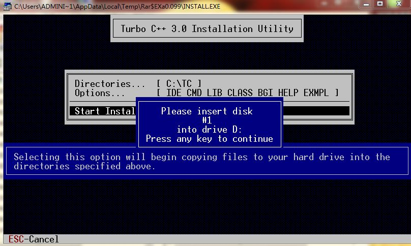

***

Please help me find a better image of inserting a disk into drive A. I want to continue this joke, and have multiple fake floppy prompts for different parts of my music archive.

The current image isn't that good, as it contains too much other activity, with less focus on the disk #2

***
